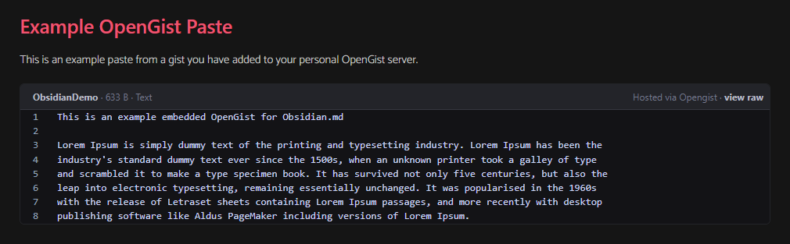
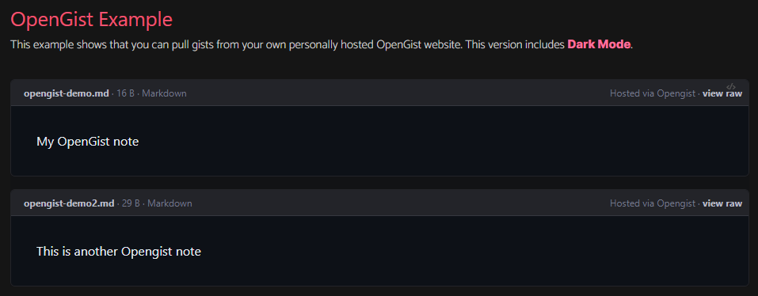
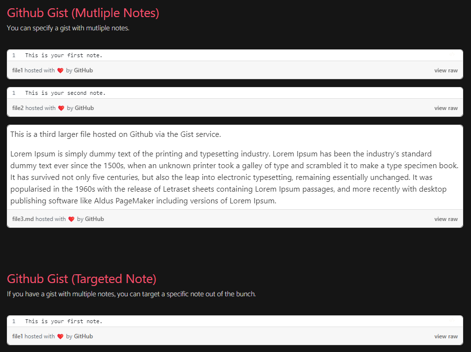

<p align="center"></p>
<h1 align="center"><b>Obsidian: Gistr</b></h1>

<div align="center">

   

</div>

---

<br />

- [About](#about)
- [Usage](#usage)
  - [OpenGist](#opengist)
  - [Github Gist](#github-gist)
- [Install](#install)
  - [Manual](#manual)
  - [BRAT Plugin Manager](#brat-plugin-manager)
- [Build](#build)
- [OpenGist - How It Works](#opengist---how-it-works)
- [Shoutouts](#shoutouts)


<br />

---

<br />

# About

Gistr allows you to embed gists that have been created from two different services:
- [OpenGist](https://github.com/thomiceli/opengist) (self-hosted)
- [Github Gist](https://gist.github.com)

<br />

<p align="center"></p>

<br />

To use this plugin, you must:
- Download and install [Obsidian.md](obsidian.md/)
- Utilize Github to store [https://gist.github.com](gists), OR;
- Configure a new or use an existing [OpenGist](https://github.com/thomiceli/opengist) Server

<br />

<div align="center">

[](https://demo.opengist.io/all)
[](https://github.com/thomiceli/opengist/releases)
[](https://github.com/thomiceli/opengist/blob/master/docs/index.md)

</div>

<br />

---

<br />

# Usage
To embed an OpenGist or Github Gist snippet, add a new code block:

<br />

## OpenGist

````shell
```gistr
https://gist.yourdomain.com/username/xxxxxxxxxxxxxxxxxxxxxxxxxxxxxxxx
gist.yourdomain.com/username/xxxxxxxxxxxxxxxxxxxxxxxxxxxxxxxx
```
````

<br />

<p align="center"></p>

<br />

<br />

## Github Gist

````shell
```gistr
https://gist.github.com/username/xxxxxxxxxxxxxxxxxxxxxxxxxxxxxxxx
gist.github.com/username/xxxxxxxxxxxxxxxxxxxxxxxxxxxxxxxx
```
````

<br />

This plugin can also fetch a Gist which contains multiple notes in a single gist collection:

<br />

<p align="center"></p>

<br />

To target a specific note inside a gist, append `#filename` to the end of your gist url:

````shell
```gistr
https://gist.github.com/Aetherinox/xxxxxxxxxxxxxxxxxxxxxxxxxxxxxxxx#file1
```
````


<br />

---

<br />

# Install
The following instructions explain how to install this plugin for Obsidian.

<br />

## Manual

- Install [Obsidian.md](obsidian.md/)
- Go to the [Releases](https://github.com/Aetherinox/obsidian-gistr/releases) tab in this Github repo, and download the associated files:
  - `main.js`
  - `manifest.json`
  - `styles.css`
  - <small>all releases also include a `.zip` with the files above.</small>

- Locate your Obsidian Plugins Folder `X:\.obsidian\plugins`
- Create new folder in **Plugins** folder labeled `gistr`
- Inside the new folder, paste the files you have downloaded from this Github repo.

```
📂 .obsidian
   📂 plugins
      📂 gistr
         📄 main.js
         📄 manifest.json
         📄 styles.css
```
- Launch Obsidian and click the Settings Cog Icon `⚙️`
- On the left, select **Community Plugins**
- Locate `Gistr` and enable it. 

<br />
<br />

## BRAT Plugin Manager

Plugin can also be installed utilizing the [BRAT](https://github.com/TfTHacker/obsidian42-brat) plugin.
- Install [BRAT](https://github.com/TfTHacker/obsidian42-brat) using the Obsidian Plugin manager
- In your Obsidian settings on the left, select **BRAT** in the list.
- In BRAT settings, click the button **Add Beta Plugin**
- In the textbox, supply the URL to this repo
  - `https://github.com/Aetherinox/obsidian-gistr`
- Once Gistr is isntalled, activate it in your Obsidian settings. 

<br />

---

<br />

# Build
For a detailed set of instructions on how to download this plugin's source files and compile your own version, check out the wiki link below:
- [How to Build Gistr](https://github.com/Aetherinox/obsidian-gistr/wiki/Build)

<br />

---

<br />

# OpenGist - How It Works
The following explains the procedure behind this plugin and OpenGist.

As of v1.6.0, [OpenGist](https://github.com/thomiceli/opengist) includes a feature which works much like Github. Every time you upload a new gist to your OpenGist website, you can view that gist normally by going to the associated link:

```
https://gist.yourdomain.com/username/000abcdef1234567abcdef1234567abc
```

<br />

With OpenGist, you may now fetch `JSON` information about a gist, and include your gist in outside programs such as Obsidian.md.

<br />

To manually view the JSON, HTML, Javascript, and CSS feeds for each of your OpenGists, append `.json` to the end of your URL:

```
https://gist.yourdomain.com/username/000abcdef1234567abcdef1234567abc.json
```

<br />

You will be presented with JSON which defines the values associated to your created gist:

```json
{
  "created_at": "2023-09-24T00:00:000",
  "description": "Opengist Demo Paste",
  "embed": {
    "css": "https://gist.domain.com/assets/embed-abcde123.css",
    "html": "<div class=\"opengist-embed\" id=\"000abcdef1234567abcdef1234567abc\">\n    <div class=\"html \">\n    \n        <div class=\"rounded-md border-1 border-gray-100 dark:border-gray-800 overflow-auto mb-4\">\n            <div class=\"border-b-1 border-gray-100 dark:border-gray-700 text-xs p-2 pl-4 bg-gray-50 dark:bg-gray-800 text-gray-400\">\n                <a target=\"_blank\" href=\"https://gist.domain.com/Username/000abcdef1234567abcdef1234567abc#file-demo\"><span class=\"font-bold text-gray-700 dark:text-gray-200\">Opengist Demo Paste</span> · 145 B · Text</a>\n                <span class=\"float-right\"><a target=\"_blank\" href=\"https://gist.domain.com\">Hosted via Opengist</a> · <span class=\"text-gray-700 dark:text-gray-200 font-bold\"><a target=\"_blank\" href=\"https://gist.domain.com/Username/000abcdef1234567abcdef1234567abc/raw/HEAD/demo_file.md\">view raw</a></span></span>\n            </div>\n            \n            \n            \n            <div class=\"code dark:bg-gray-900\">\n            \n            \n                <table class=\"chroma table-code w-full whitespace-pre\" data-filename-slug=\"demo\" data-filename=\"demo\" style=\"font-size: 0.8em; border-spacing: 0; border-collapse: collapse;\">\n                    <tbody>\n                        \n                        \n                        <tr><td id=\"file-demo-1\" class=\"select-none line-num px-4\">1</td><td class=\"line-code\">Opengist Demo Paste\n</td></tr>\n                    </tbody>\n                </table>\n            \n            </div>\n            \n\n        </div>\n    \n    </div>\n</div>\n",
    "js": "https://gist.domain.com/Username/000abcdef1234567abcdef1234567abc.js",
    "js_dark": "https://gist.domain.com/Username/000abcdef1234567abcdef1234567abc.js?dark"
  },
  "files": [
    {
      "filename": "demo",
      "size": 743,
      "human_size": "145 B",
      "content": "Opengist Demo Paste",
      "truncated": false,
      "type": "Text"
    }
  ],
  "id": "000abcdef1234567abcdef1234567abc",
  "owner": "Username",
  "title": "Opengist Demo Paste",
  "uuid": "000abcdef1234567abcdef1234567abc",
  "visibility": "unlisted"
}
```

<br />

---

<br />

# Shoutouts
- [thomiceli](https://github.com/thomiceli)  over at [OpenGist](https://github.com/thomiceli/opengist) for implementing the JSON functionality request.
- [linjunpop](https://github.com/linjunpop) for developing the first Obsidian [Gist](https://github.com/linjunpop/obsidian-gist) plugin. It was a top choice in my list of plugins used.